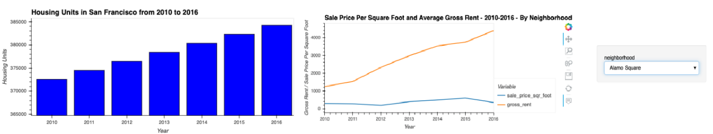

# San Francisco Housing Analysis

This project is an analysis of the housing market (rental and sale) in San Francisco for the period 2010-2016.

We do an analysis calculating and ploting the following for different neighborhoods in SF:

* Housing units per year.
* Average prices per square foot.
* Average prices by neighborhood.

With this data, we compare neighborhoods and build an interactive neighborhood map that helps us compose a data story for potential Real Estate investments in the area.

---

## Technologies

The whole project is implemented in Python, writen in Jupyter lab using the Pandas library and matplotlib for plotting: 

* ```import pandas as pd```
* ```from pathlib import Path```

For the visualization part, we import hvplot:

* ```import hvplot.pandas```

The main ```san_francisco_housing.ipynb``` file reads from the csv files contained in the 'Resources' folder.

---

## Usage

Run the main ```san_francisco_housing.ipynb``` in Jupyter Lab. On it:

We **first** calculate and plot the housing units per year, and the evolution of rent and sale prices with a widget that allows to filter by neighborhood:



**Secondly**, we build an interactive neighborhood map using ```hvplot``` and ```GeoViews```, in which the point size reflects the sale price average and the color reflects the gross rent (averages).


With all these visualiztions and data, we compose a **Data Story** in which the main conclusions are:

* Rental prices have gone up consistently in all the neighborhoods for which we have data for the whole period 2010-2016. Sale prices have gone down only in 3 of the neigborhoods, while they have more than duplicated in 35 cases. This might reflect the high building density in the area and the difficulty to build new houses. 

* I would recommend buying a piece in the neighborhoods where sale prices have gone down or kept stable, and offering it for rent. It is also important to analyze why prices fell in those areas to see if there might be potential issues with rentals there.

---

## Contributors

Feature developed by Lourdes Dominguez [(LinkedIn profile)](https://www.linkedin.com/in/lourdes-dominguez-bengoa-12333044/)

---

## License

Use only for academic purposes.